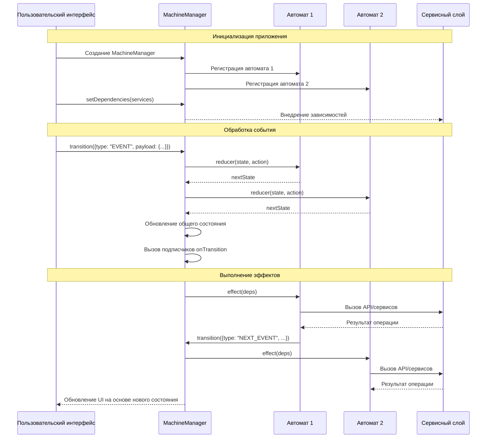

# Руководство по использованию

В этом разделе показано, как описать и запустить конечные автоматы с `lite-fsm`.

## Основные концепции

Библиотека построена вокруг нескольких ключевых концепций.

### Состояния и переходы

Автомат всегда находится в одном из явно описанных состояний. Переход в другое состояние происходит при обработке события (action).

### Контекст

Контекст — это объект с данными автомата. Его можно обновлять при каждом переходе в reducer-е.

### Эффекты

Эффекты — функции, которые выполняются при входе в указанное состояние. В них живут все побочные действия: запросы, таймеры, вызовы сервисов.

### Менеджер автоматов

`MachineManager` объединяет несколько автоматов, маршрутизирует события и запускает эффекты.

## Создание автомата

Автомат описывается через `createMachine`:

```ts showLineNumbers copy
import { createMachine } from "@lite-fsm/core";

const toggle = createMachine({
  config: {
    INACTIVE: {
      TOGGLE: "ACTIVE",
    },
    ACTIVE: {
      TOGGLE: "INACTIVE",
    },
  },
  initialState: "INACTIVE",
  initialContext: {
    lastToggledAt: null as number | null,
  },
  reducer: (state, action, { nextState }) => {
    state.state = nextState;
    if (action.type === "TOGGLE") {
      state.context.lastToggledAt = action.payload.now;
    }
  },
  effects: {
    ACTIVE: () => console.log("Активировано"),
    INACTIVE: () => console.log("Деактивировано"),
  },
});
```

Reducer выше написан в стиле Immer — он мутирует draft и ничего не возвращает. Чтобы это работало, нужно подключить `immerMiddleware` (см. ниже). Без него reducer должен возвращать новый объект `{ state, context }`.

> Имена состояний и событий рекомендуем писать в `UPPER_SNAKE_CASE` (`IDLE`, `LOAD_DATA`, `RESOLVE`). Это делает граф переходов читаемым и хорошо отличает event types от обычных значений.

## Запуск через MachineManager

```ts showLineNumbers copy
import { MachineManager } from "@lite-fsm/core";
import { immerMiddleware } from "@lite-fsm/middleware/immer";

const manager = MachineManager(
  { toggle },
  { middleware: [immerMiddleware] },
);

manager.onTransition((prev, next, action) => {
  console.log("Состояние изменилось:", { prev, next, action });
});

manager.transition({ type: "TOGGLE", payload: { now: Date.now() } });

const { state, context } = manager.getState().toggle;
```

В `manager` можно передать сразу несколько автоматов — каждое событие пойдёт во все из них:

```ts showLineNumbers copy
const manager = MachineManager({ toggle, counter, profile });
```

## Внедрение зависимостей

Зависимости (сервисы, утилиты, доступ к manager-у) задаются через `setDependencies`. Они становятся доступны как поля параметра эффекта.

```ts showLineNumbers copy
manager.setDependencies({
  api: {
    fetchData: () => fetch("/api/data").then((r) => r.json()),
  },
  getState: manager.getState,
});

const data = createMachine({
  config: {
    IDLE: {
      FETCH: "LOADING",
    },
    LOADING: {
      FETCH_RESOLVE: "READY",
      FETCH_REJECT: "ERROR",
    },
    READY: {
      RESET: "IDLE",
    },
    ERROR: {
      RETRY: "LOADING",
      RESET: "IDLE",
    },
  },
  initialState: "IDLE",
  initialContext: {
    items: [] as string[],
    error: null as string | null,
  },
  reducer: (state, action, { nextState }) => {
    state.state = nextState;
    if (action.type === "FETCH_RESOLVE") state.context.items = action.payload.items;
    if (action.type === "FETCH_REJECT") state.context.error = action.payload.error;
  },
  effects: {
    LOADING: async ({ api, transition }) => {
      try {
        const items = await api.fetchData();
        transition({ type: "FETCH_RESOLVE", payload: { items } });
      } catch (error) {
        transition({
          type: "FETCH_REJECT",
          payload: { error: error instanceof Error ? error.message : "unknown" },
        });
      }
    },
  },
});
```

Внутри эффекта `transition(...)` отправляет новое событие через тот же manager.

## Асинхронные эффекты

Эффект может быть `async`. Любой `await` внутри отрабатывает в обычном режиме:

```ts showLineNumbers copy
effects: {
  LOADING: async ({ api, transition }) => {
    try {
      const result = await api.fetchSomething();
      transition({ type: "FETCH_RESOLVE", payload: { data: result } });
    } catch (error) {
      transition({
        type: "FETCH_REJECT",
        payload: { error: error instanceof Error ? error.message : "unknown" },
      });
    }
  },
}
```

> Если нужно отменять промежуточные `transition` при смене состояния, оборачивайте эффект в `createEffect({ type: "latest", ... })` или используйте собственный `cancelFn`. Подробнее — в разделе [Отмена эффектов](/guide/advanced-concepts/cancel-effects).

## Обработка событий в любом состоянии

Чтобы переход срабатывал из любого состояния, опишите его в специальном ключе `"*"`. Явный переход в конкретном состоянии всегда приоритетнее wildcard:

```ts showLineNumbers copy
const machine = createMachine({
  config: {
    STATE_A: {
      EVENT_1: "STATE_B",
    },
    STATE_B: {
      EVENT_2: "STATE_C",
    },
    STATE_C: {
      EVENT_3: "STATE_A",
    },
    "*": {
      RESET: "STATE_A",
      LOG: null,
    },
  },
  initialState: "STATE_A",
  initialContext: {},
});
```

Цель `null` — это self-transition: state не меняется, но action всё равно доходит до reducer-а и эффектов.

## Архитектура приложения на основе lite-fsm

Следующая sequence-диаграмма демонстрирует архитектуру типичного приложения, построенного с использованием lite-fsm:



Основные компоненты архитектуры:

1. **Пользовательский интерфейс (UI)**: Отображает состояние приложения и отправляет события в `MachineManager`.

2. **MachineManager**: Центральный координатор, который:

   - Хранит общее состояние всех автоматов
   - Передает события в зарегистрированные автоматы
   - Запускает эффекты при изменении состояний
   - Уведомляет подписчиков об изменениях состояния
   - Внедряет зависимости (сервисы, утилиты) в эффекты

3. **Автоматы**: Определяют:

   - Состояния и переходы между ними
   - Логику обновления контекста (данных)
   - Эффекты, выполняемые при входе в определенные состояния

4. **Сервисный слой**: Содержит внешние зависимости:
   - API-клиенты для взаимодействия с серверами
   - Сервисы для работы с хранилищем, логированием и т.д.
   - Утилиты и хелперы для обработки данных

Такая архитектура обеспечивает чёткое разделение ответственности между компонентами, предсказуемое поведение приложения и упрощает тестирование, поскольку все взаимодействия происходят через явно определенные интерфейсы.

## Преимущества выделения бизнес-логики в автоматы

Один из ключевых архитектурных принципов при использовании lite-fsm — выделение всей бизнес-логики в автоматы (редьюсеры и эффекты) и сервисный слой. Компоненты пользовательского интерфейса при этом только отображают данные и отправляют события. Этот подход имеет ряд существенных преимуществ по сравнению с написанием бизнес-логики непосредственно в React-компонентах.

### 1. Разделение ответственности

**Традиционный подход с React Hooks:**

```jsx showLineNumbers copy
function UserProfile() {
  const [user, setUser] = useState(null);
  const [loading, setLoading] = useState(false);
  const [error, setError] = useState(null);

  useEffect(() => {
    async function fetchUser() {
      setLoading(true);
      try {
        const response = await fetch("/api/user");
        const data = await response.json();
        setUser(data);
      } catch (err) {
        setError(err.message);
      } finally {
        setLoading(false);
      }
    }
    fetchUser();
  }, []);

  // JSX с обработкой разных состояний...
}
```

**Подход с lite-fsm:**

```jsx showLineNumbers copy
function UserProfile() {
  const { state, context } = useSelector((s) => s.user);
  const transition = useTransition();

  useEffect(() => {
    transition({ type: "FETCH_USER" });
  }, [transition]);

  // JSX с обработкой разных состояний...
}
```

Бизнес-логика теперь живёт в автомате `user`: его состояние определяет UI, а эффекты выполняют все побочные действия.

### 2. Ключевые преимущества

#### Предсказуемость и отслеживаемость

- **Явные состояния**: Все возможные состояния системы явно описаны и документированы
- **Центральное управление**: Все переходы между состояниями происходят контролируемо через одну точку входа
- **Логирование и отладка**: Легко отслеживать все изменения состояния, так как они происходят через `transition`
- **Разработка через тестирование**: Каждый переход и эффект можно тестировать изолированно без сложных моков React-хуков
- **Внедрение аналитики**: Благодаря явным событиям легко добавлять аналитические системы и внешние интеграции, перехватывая события в одном месте

#### Управление сложностью

- **Масштабируемость**: Легко добавлять новые состояния и обработчики без разрастания компонентов
- **Локализация изменений**: Изменения в бизнес-логике не требуют правок во множестве компонентов
- **Изолированная разработка**: Разные команды могут работать над UI и бизнес-логикой параллельно
- **Контроль побочных эффектов**: Все асинхронные операции сгруппированы в эффектах и происходят предсказуемо
- **Изоляция неоптимального кода**: Даже если в отдельном автомате присутствует неоптимальный код, он изолирован и не влияет на проект в целом
- **Контроль сложности проекта**: Разделение бизнес-логики на отдельные автоматы позволяет легко управлять сложностью даже в крупных приложениях

#### Улучшение кодовой базы

- **Чистые компоненты**: UI-компоненты фокусируются только на отображении и взаимодействии
- **Переиспользование логики**: Бизнес-логика не привязана к компонентам и может использоваться в разных частях приложения
- **Лёгкая замена технологий**: Можно заменить React на другую UI-библиотеку без переписывания бизнес-логики
- **Снижение дублирования**: Общая логика по управлению состояниями вынесена на уровень автоматов

#### Улучшение пользовательского опыта

- **Отзывчивость UI**: Компоненты становятся проще и рендерятся быстрее
- **Меньше ошибок**: Явное моделирование состояний помогает обрабатывать все возможные сценарии
- **Консистентное поведение**: Все переходы между состояниями чётко определены и работают одинаково во всём приложении

### 3. Сравнение с useEffect

Использование `useEffect` в React для управления побочными эффектами имеет ряд недостатков:

1. **Разбросанность логики**: Логика часто распределена между несколькими хуками в одном компоненте
2. **Нечёткие зависимости**: Массив зависимостей часто становится источником ошибок и бесконечных циклов
3. **Сложность тестирования**: Тестирование компонентов с несколькими `useEffect` требует сложной настройки
4. **Отсутствие явной модели состояний**: Состояния неявно определяются комбинациями переменных состояния
5. **Сложность отмены эффектов**: Функция очистки в `useEffect` часто реализуется не до конца или с ошибками

В подходе с lite-fsm эти проблемы решены:

- Вся бизнес-логика централизована в автоматах
- Все состояния явно определены
- Переходы между состояниями контролируются автоматом
- Эффекты привязаны к конкретным состояниям
- Тестирование логики можно проводить без зависимости от React
