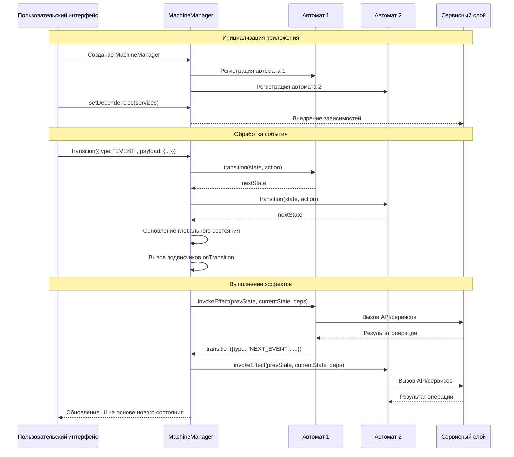

# Руководство по использованию

В этом разделе вы узнаете, как использовать `lite-fsm` для создания и управления конечными автоматами в ваших приложениях.

## Основные концепции

Библиотека `lite-fsm` построена вокруг нескольких ключевых концепций:

### Состояния и переходы

Конечный автомат всегда находится в определенном состоянии. Переход между состояниями происходит в результате обработки событий (actions).

### Контекст

Контекст представляет собой объект с данными, связанными с автоматом. При переходе между состояниями контекст может обновляться.

### Эффекты

Эффекты - это функции, которые выполняются при переходе в определенное состояние. Они могут использоваться для выполнения побочных действий, таких как вызов API или обновление UI.

### Менеджер автоматов

`MachineManager` управляет всеми автоматами, обрабатывает переходы состояний и запускает соответствующие эффекты.

## Создание автомата

Автомат создается с помощью функции `createMachine`:

```ts
import { createMachine } from "lite-fsm";

const toggleMachine = createMachine({
  // Конфигурация состояний и переходов
  config: {
    INACTIVE: {
      TOGGLE: "ACTIVE",
    },
    ACTIVE: {
      TOGGLE: "INACTIVE",
    },
  },
  // Начальное состояние
  initialState: "INACTIVE",
  // Начальный контекст
  initialContext: {
    lastToggled: null,
  },
  // Эффекты при переходе в состояния
  effects: {
    ACTIVE: ({ transition }) => {
      console.log("Активировано!");
      // Здесь можно выполнить побочные эффекты
    },
    INACTIVE: ({ transition }) => {
      console.log("Деактивировано!");
      // Здесь можно выполнить побочные эффекты
    },
  },
  // Пользовательский reducer для обработки переходов (опционально)
  reducer: (state, action, options) => {
    // По умолчанию используется стандартный reducer
    // Здесь можно изменить логику обновления состояния и контекста
    return {
      state: options.nextState,
      context: {
        ...state.context,
      },
    };
  },
});
```

## Управление автоматом через MachineManager

После создания автомата, нужно инициализировать менеджер:

```ts
import { MachineManager } from "lite-fsm";

// Можно создать несколько автоматов и управлять ими через один менеджер
const manager = MachineManager({
  toggle: toggleMachine,
  // другие автоматы ...
});

// Подписка на изменения состояний
manager.onTransition((prevState, nextState) => {
  console.log("Состояние изменилось:", { prevState, nextState });
});

// Вызов перехода
manager.transition({ type: "TOGGLE" });

// Получение текущего состояния и контекста
const { state, context } = manager.getState().toggle;
```

## Внедрение зависимостей

Менеджер позволяет внедрять зависимости, которые будут доступны в эффектах:

```ts
// Создание зависимостей
const dependencies = {
  services: {
    api: {
      fetchData: () => fetch("/api/data").then((r) => r.json()),
    },
    logger: {
      log: (message) => console.log(`[LOG]: ${message}`),
    },
  },
  utils: {
    formatDate: (date) => new Intl.DateTimeFormat().format(date),
  },
};

// Установка зависимостей
manager.setDependencies(dependencies);

// Автомат с использованием зависимостей
const dataMachine = createMachine({
  config: {
    IDLE: {
      FETCH: "LOADING",
    },
    LOADING: {
      FETCH_SUCCESS: "SUCCESS",
      FETCH_ERROR: "ERROR",
    },
    SUCCESS: {
      RESET: "IDLE",
    },
    ERROR: {
      RETRY: "LOADING",
      RESET: "IDLE",
    },
  },
  initialState: "IDLE",
  initialContext: {
    data: null,
    error: null,
    lastUpdated: null,
  },
  effects: {
    // Зависимости доступны в параметрах эффекта
    LOADING: async ({ transition, services, utils }) => {
      try {
        const data = await services.api.fetchData();
        services.logger.log("Данные успешно загружены");
        transition({
          type: "FETCH_SUCCESS",
          payload: {
            data,
            lastUpdated: utils.formatDate(new Date()),
          },
        });
      } catch (error) {
        services.logger.log("Ошибка при загрузке данных");
        transition({
          type: "FETCH_ERROR",
          payload: { error: error.message },
        });
      }
    },
  },
});
```

## Асинхронные эффекты

Эффекты могут быть асинхронными, что позволяет легко интегрировать их с API и другими асинхронными операциями:

```ts
effects: {
  LOADING: async ({ transition, services }) => {
    try {
      // Асинхронная операция
      const result = await services.api.fetchSomething();

      // Передаем данные в контекст через payload
      transition({
        type: "FETCH_SUCCESS",
        payload: { data: result },
      });
    } catch (error) {
      transition({
        type: "FETCH_ERROR",
        payload: { error: error.message },
      });
    }
  };
}
```

## Дополнительные возможности

### Обработка событий в любом состоянии (WILDCARD)

Можно использовать специальный символ `*` для обработки любого состояния:

```ts
import { createMachine, WILDCARD } from "lite-fsm";

const machine = createMachine({
  config: {
    STATE_A: {
      EVENT_1: "STATE_B",
    },
    STATE_B: {
      EVENT_2: "STATE_C",
    },
    STATE_C: {
      EVENT_3: "STATE_A",
    },
    // Обработка событий в любом состоянии
    [WILDCARD]: {
      RESET: "STATE_A",
      LOG: null, // null означает, что состояние не меняется
    },
  },
  // ...
});
```

### Создание эффектов с отменой

Библиотека позволяет создавать эффекты с возможностью отмены:

```ts
import { createEffect } from "lite-fsm";

const fetchDataEffect = createEffect({
  // Тип эффекта: "latest" выполняет только последний вызов
  type: "latest",
  effect: async ({ transition, services }) => {
    // Реализация эффекта
    const data = await services.api.fetchData();
    transition({ type: "FETCH_SUCCESS", payload: { data } });
  },
  // Функция для проверки условий отмены
  cancelFn: (deps) => {
    let canceled = false;
    return () => {
      return canceled;
    };
  },
});
```

## Архитектура приложения на основе lite-fsm

Следующая sequence диаграмма демонстрирует архитектуру типичного приложения, построенного с использованием lite-fsm:



Основные компоненты архитектуры:

1. **Пользовательский интерфейс (UI)**: Отображает состояние приложения и отправляет события в `MachineManager`.

2. **MachineManager**: Центральный координатор, который:

   - Хранит глобальное состояние всех автоматов
   - Передает события в зарегистрированные автоматы
   - Запускает эффекты при изменении состояний
   - Уведомляет подписчиков об изменениях состояния
   - Внедряет зависимости (сервисы, утилиты) в автоматы

3. **Автоматы**: Определяют:

   - Состояния и переходы между ними
   - Логику обновления контекста (данных)
   - Эффекты, выполняемые при входе в определенные состояния

4. **Сервисный слой**: Содержит внешние зависимости:
   - API-клиенты для взаимодействия с серверами
   - Сервисы для работы с хранилищем, логированием и т.д.
   - Утилиты и хелперы для обработки данных

Такая архитектура обеспечивает чёткое разделение ответственности между компонентами, предсказуемое поведение приложения и упрощает тестирование, поскольку все взаимодействия происходят через явно определенные интерфейсы.

## Преимущества выделения бизнес-логики в автоматы

Один из ключевых архитектурных принципов при использовании lite-fsm — выделение всей бизнес-логики в автоматы (редьюсеры и эффекты) и сервисный слой, при этом компоненты пользовательского интерфейса только отображают данные и отправляют события. Этот подход имеет ряд существенных преимуществ по сравнению с традиционным написанием бизнес-логики непосредственно в React-компонентах:

### 1. Разделение ответственности

**Традиционный подход с React Hooks:**

```jsx
function UserProfile() {
  const [user, setUser] = useState(null);
  const [loading, setLoading] = useState(false);
  const [error, setError] = useState(null);

  useEffect(() => {
    async function fetchUser() {
      setLoading(true);
      try {
        const response = await fetch("/api/user");
        const data = await response.json();
        setUser(data);
        setLoading(false);
      } catch (err) {
        setError(err.message);
        setLoading(false);
      }
    }
    fetchUser();
  }, []);

  const updateUser = async (userData) => {
    try {
      setLoading(true);
      await fetch("/api/user", {
        method: "PUT",
        body: JSON.stringify(userData),
      });
      setUser({ ...user, ...userData });
      setLoading(false);
    } catch (err) {
      setError(err.message);
      setLoading(false);
    }
  };

  // JSX с обработкой разных состояний...
}
```

**Подход с lite-fsm:**

```jsx
// Компонент - только отображение и отправка событий
function UserProfile() {
  const { state, context } = useSelector((state) => state.user);
  const transition = useTransition();

  useEffect(() => {
    transition({ type: "FETCH_USER" });
  }, []);

  const handleUpdate = (userData) => {
    transition({ type: "UPDATE_USER", payload: userData });
  };

  // JSX с обработкой разных состояний...
}
```

### 2. Ключевые преимущества

#### Предсказуемость и отслеживаемость

- **Явные состояния**: Все возможные состояния системы явно описаны и документированы
- **Центральное управление**: Все переходы между состояниями происходят контролируемо через одну точку входа
- **Логирование и отладка**: Легко отслеживать все изменения состояния, так как они происходят через `transition`
- **Разработка через тестирование**: Каждый переход и эффект можно тестировать изолированно без сложных моков React-хуков
- **Внедрение аналитики**: Благодаря явным событиям легко добавлять аналитические системы и внешние интеграции, перехватывая события в одном месте

#### Управление сложностью

- **Масштабируемость**: Легко добавлять новые состояния и обработчики без разрастания компонентов
- **Локализация изменений**: Изменения в бизнес-логике не требуют правок во множестве компонентов
- **Изолированная разработка**: Разные команды могут работать над UI и бизнес-логикой параллельно
- **Контроль побочных эффектов**: Все асинхронные операции сгруппированы в эффектах и происходят предсказуемо
- **Изоляция неоптимального кода**: Даже если в отдельном автомате присутствует неоптимальный код, он изолирован и не влияет на проект в целом
- **Контроль сложности проекта**: Разделение бизнес-логики на отдельные автоматы позволяет легко управлять сложностью даже в крупных приложениях

#### Улучшение кодовой базы

- **Чистые компоненты**: UI-компоненты фокусируются только на отображении и взаимодействии
- **Переиспользование логики**: Бизнес-логика не привязана к компонентам и может использоваться в разных частях приложения
- **Лёгкая замена технологий**: Можно заменить React на другую UI-библиотеку без переписывания бизнес-логики
- **Снижение дублирования**: Общая логика по управлению состояниями вынесена на уровень автоматов

#### Улучшение пользовательского опыта

- **Отзывчивость UI**: Компоненты становятся проще и рендерятся быстрее
- **Меньше ошибок**: Явное моделирование состояний помогает обрабатывать все возможные сценарии
- **Консистентное поведение**: Все переходы между состояниями чётко определены и работают одинаково во всём приложении

### 3. Сравнение с useEffect

Использование `useEffect` в React для управления побочными эффектами имеет ряд недостатков:

1. **Разбросанность логики**: Логика часто распределена между несколькими хуками в одном компоненте
2. **Нечёткие зависимости**: Массив зависимостей часто становится источником ошибок и бесконечных циклов
3. **Сложность тестирования**: Тестирование компонентов с несколькими `useEffect` требует сложной настройки
4. **Отсутствие явной модели состояний**: Состояния неявно определяются комбинациями переменных состояния
5. **Сложность отмены эффектов**: Функция очистки в `useEffect` часто реализуется не до конца или с ошибками

В подходе с lite-fsm эти проблемы решены:

- Вся бизнес-логика централизована в автоматах
- Все состояния явно определены
- Переходы между состояниями контролируются автоматом
- Эффекты привязаны к конкретным состояниям
- Тестирование логики можно проводить без зависимости от React

### 4. Конкретный пример улучшения

**До (React компонент с логикой):**

```jsx
function PaymentForm() {
  const [paymentMethod, setPaymentMethod] = useState("card");
  const [cardDetails, setCardDetails] = useState({});
  const [processing, setProcessing] = useState(false);
  const [error, setError] = useState(null);
  const [success, setSuccess] = useState(false);

  const handleSubmit = async (e) => {
    e.preventDefault();
    setProcessing(true);
    setError(null);

    try {
      if (paymentMethod === "card") {
        // Валидация карты
        if (!cardDetails.number) {
          throw new Error("Card number is required");
        }
        // Обработка платежа
        await processCardPayment(cardDetails);
      } else if (paymentMethod === "paypal") {
        // Обработка PayPal
        await processPayPalPayment();
      }

      setSuccess(true);
      setProcessing(false);
    } catch (err) {
      setError(err.message);
      setProcessing(false);
    }
  };

  // Многочисленные обработчики изменений форм...
  // Условная логика отображения
}
```

**После (с lite-fsm):**

```jsx
// Компонент только для отображения
function PaymentForm() {
  const { state, context } = useSelector((state) => state.payment);
  const transition = useTransition();

  const handlePaymentMethodChange = (method) => {
    transition({ type: "CHANGE_PAYMENT_METHOD", payload: { method } });
  };

  const handleCardDetailsChange = (details) => {
    transition({ type: "UPDATE_CARD_DETAILS", payload: details });
  };

  const handleSubmit = (e) => {
    e.preventDefault();
    transition({ type: "SUBMIT_PAYMENT" });
  };

  // Простая логика отображения на основе состояния
  return <form onSubmit={handleSubmit}>{/* Форма на основе state и context */}</form>;
}

// Автомат с бизнес-логикой в отдельном файле
const paymentMachine = createMachine({
  config: {
    IDLE: {
      CHANGE_PAYMENT_METHOD: null,
      UPDATE_CARD_DETAILS: null,
      SUBMIT_PAYMENT: "VALIDATING",
    },
    VALIDATING: {
      VALIDATION_SUCCESS: "PROCESSING",
      VALIDATION_FAILURE: "VALIDATION_ERROR",
    },
    VALIDATION_ERROR: {
      CHANGE_PAYMENT_METHOD: null,
      UPDATE_CARD_DETAILS: null,
      SUBMIT_PAYMENT: "VALIDATING",
    },
    PROCESSING: {
      PAYMENT_SUCCESS: "SUCCESS",
      PAYMENT_FAILURE: "PAYMENT_ERROR",
    },
    PAYMENT_ERROR: {
      RETRY_PAYMENT: "PROCESSING",
      CHANGE_PAYMENT_METHOD: "IDLE",
    },
    SUCCESS: {
      NEW_PAYMENT: "IDLE",
    },
  },
  // Остальная логика автомата...
});
```

В результате такого подхода код становится более структурированным, тестируемым и масштабируемым, а поведение приложения — более предсказуемым и устойчивым к ошибкам.
